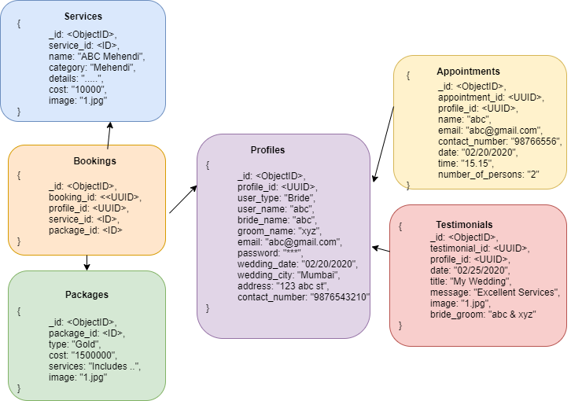
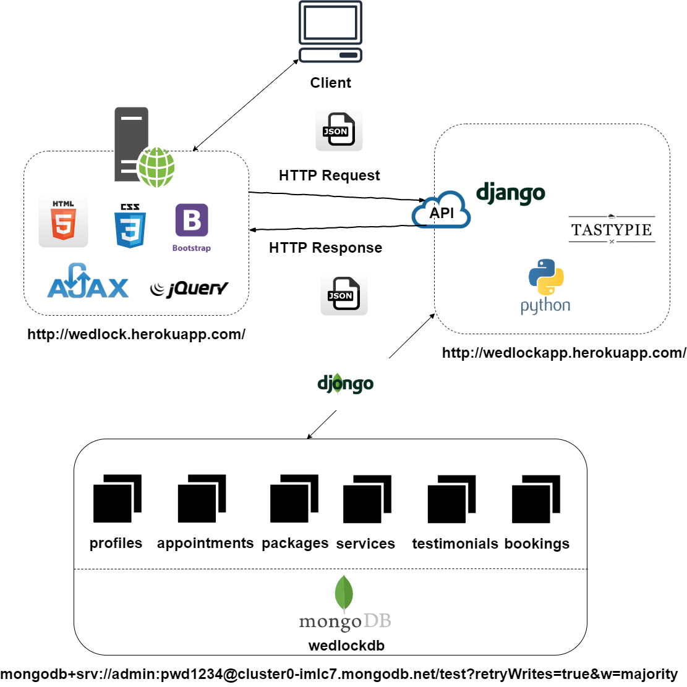

# WedLock
This is a full-stack web application to provide wedding services to the user. It focuses on the concept of emotional web design, responsive web design and mobile first design.

## Tools Used
- MongoDB Compass
- Visual Studio 2017
- Postman
- Git Bash
- Heroku server

## Technologies used
- HTML5
- CSS3
- AJAX & jQuery
- Django Tastypie Framework

## Non-relational schema

## System Architecture
